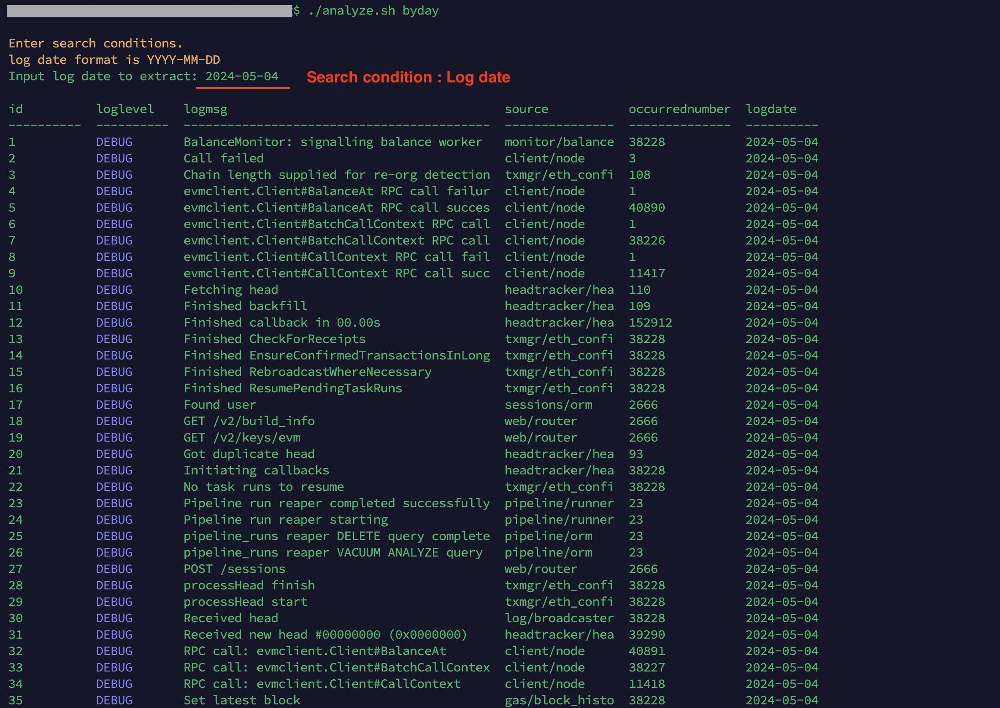
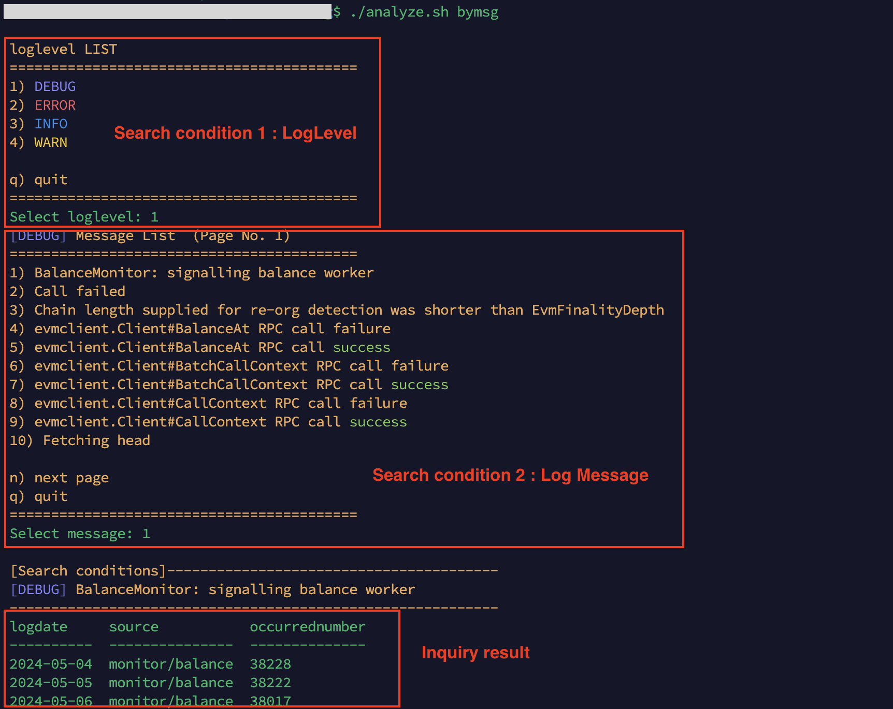

# analyzePliNodeLog
[Japanese](./README_jp.md)<br>
This is a tool for analyzing logs output by Plugin Node. <br>
Checks the rotated pm2 logs and stores the aggregated results for each log pattern in the database. <br>
Since we use rotated pm2 logs, the logs from the previous day are targeted. <br>
The database uses lightweight SQLite.

## Setup
```
git clone https://github.com/AoiToSouma/analyzePliNodeLog
cd analyzePliNodeLog
chmod +x *.sh
```

## Initialize
Install the sqlite3 package and create a database.
```
./initialize.sh
```
pli_log_analysis.db is created in the data directory. <br>
The database name can be changed by editing ```.env```.

### (Appendix) Table inquiry
```
sqlite3 data/pli_log_analysis.db ".tables"
```
Display the table list.
```aggregation``` and ```logpattern``` exist. <br>
aggregation: The aggregated number of logs for each daily log pattern is stored. <br>
logpattern: Contains the log level, log source, and patterned log messages. <br>

```
sqlite3 data/pli_log_analysis.db ".schema aggregation"
sqlite3 data/pli_log_analysis.db ".schema logpattern"
```
Display the table definition.

## Aggregation
Recognizes log patterns from rotated pm2 logs, aggregates the number of logs, and stores them in the database.
```
./aggregation.sh
```
Logs from the same day are restricted from being collected. <br>
If you run it regularly after midnight when the logs are rotated using ```cron```, <br>
it will be hassle-free and you will never forget the aggregation process.

## Analyze
This is a function to analyze the aggregated results. <br>
See below for how to do this.
```
./analyze.sh
```
example)<br>
```./analyze.sh byday``` allows you to specify the date and query the logs aggregated for each day. <br>

```./analyze.sh bymsg``` allows you to specify the message and query the occurrence date and number of occurrences. <br>


## Clear database
To initialize the database, delete the created SQLite database file.
```
rm -rf data/
```
