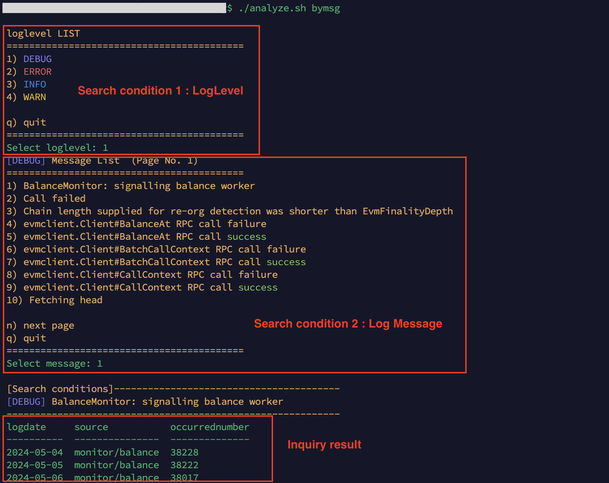

# analyzePliNodeLog
[English](./README.md)<br>
Plugin Nodeが出力するログを分析するためのツールです。<br>
ログローテートされたpm2ログをチェックしログパターンごとに集計された結果をデータベースに格納します。<br>
ログローテートされたpm2ログを使用するため、前日分のログが対象となります。<br>
データベースは軽量のSQLiteを使用しています。

## セットアップ
```
git clone https://github.com/AoiToSouma/analyzePliNodeLog
cd analyzePliNodeLog
chmod +x *.sh
```

## 初期化
sqlite3 パッケージをインストールし、データベースを作成します。
```
./initialize.sh
```
dataディレクトリにpli_log_analysis.dbが作成されます。<br>
データベース名は```.env```を編集することで変更が可能です。

### （参考）テーブル照会
```
sqlite3 data/pli_log_analysis.db ".tables"
```
テーブル一覧を表示します。
```aggregation```と```logpattern```が存在しています。<br>
aggregation : 日毎のログパターン毎に集計された件数が格納されます。<br>
logpattern : ログレベル、ログ発生ソース、パターン化されたログメッセージが格納されます。<br>
```
sqlite3 data/pli_log_analysis.db ".schema aggregation"
sqlite3 data/pli_log_analysis.db ".schema logpattern"
```
テーブル定義を表示します。

## 集計
ログローテートされたpm2ログからログパターンを認識し、件数を集計してデータベースに格納します。
```
./aggregation.sh
```
同じ日のログは収集されないように制限されています。<br>
cronなどでログローテートされる0時過ぎに定期実行するようにしておくと手間もなく集計処理を忘れることもないでしょう。

## 分析
集計結果を分析する機能です。<br>
実行方法は下記を参照してください。
```
./analyze.sh
```
例)<br>
```./analyze.sh byday```は日付を指定して日毎に集計されたログを照会できます。<br>

```./analyze.sh bymsg```はメッセージを指定して発生日と発生件数を照会できます。<br>


## データベースのクリア
データベースを初期化するには、作成されたSQLiteのデータベースファイルを削除します。
```
rm -rf data/
```
